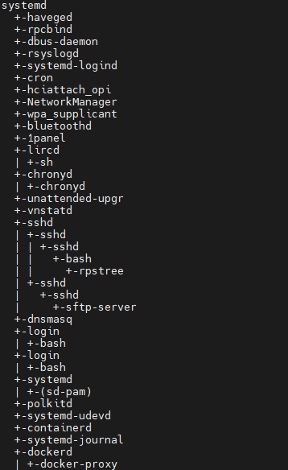

# rpstree
基于rust编写的查看进程树的命令行工具，适用于Linux系统。


## Usage
使用如下命令显示所有顶级进程及其子进程
```shell
Usage: rpstree [OPTION]
Show the process tree of the system

Options:
  -p, --pid           Show PID of the process
  -n, --numeric-sort  Sort processes by PID
  -h, --help          Display this help and exit
  -v, --version       Output version information and exit
```
## Build
可以使用下面的命令构建二进制可执行程序(需要安装`cargo`):
```shell
git clone https://github.com/LaixiLiu/rpstree.git
cd rpstree
cargo build --release
```
你可以在`target/rpstree`目录下找到二进制可执行程序`rpstree`。
